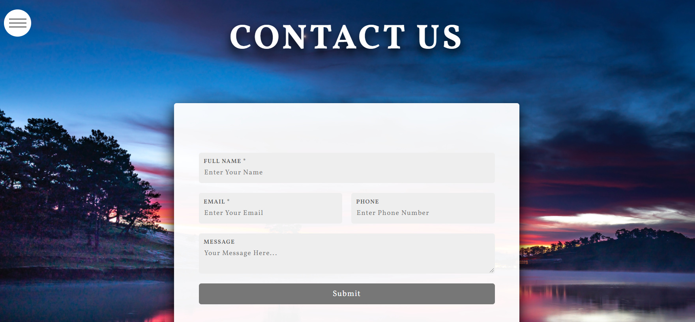

# Travel-is-My-Thing

This is a Frontend CSS driven responsive website that introduces users to travel the world. This is a travel booking agency where people can check out famous travel destinations, learn about what the testimonials are, and contact the agency for any further inquiries.

I rely heavily on CSS to optimize color, padding, overlays, and graphic animation to make the page look stunningly beautiful and interactive, and I utilize QuerySelector in Javascript to functionalize price card, side-bar menu, Contact Us card, and other graphi animations. The implementations of motion-graphics add another layer of interactive design to the website as well. 
